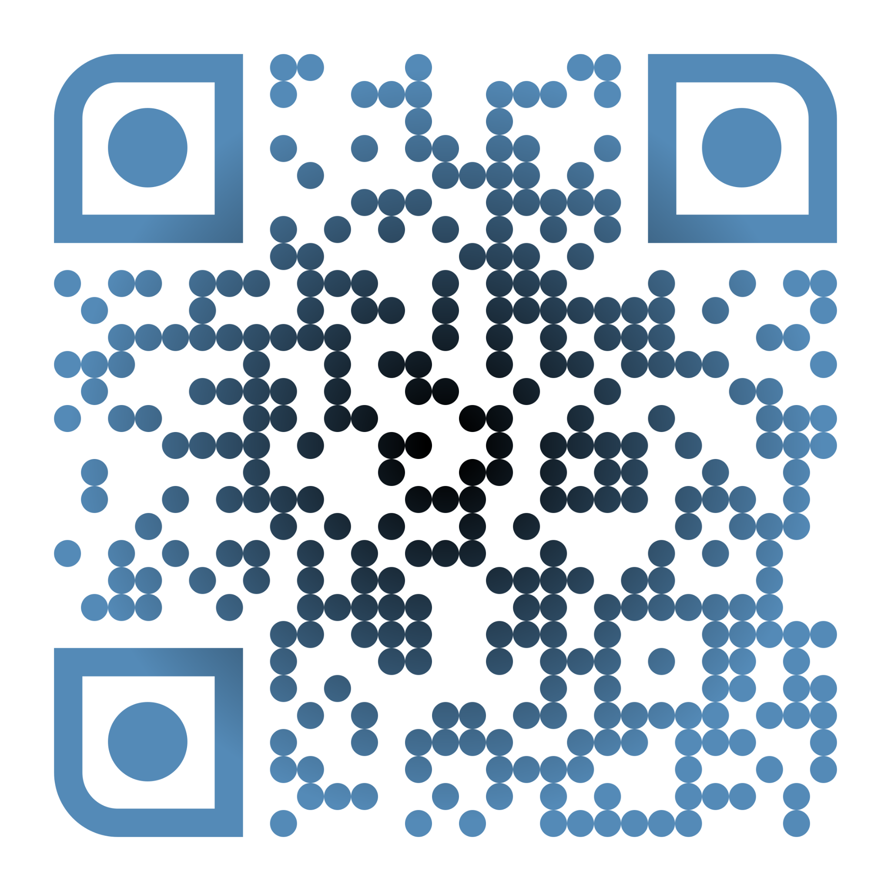

- [portfolio-website](#portfolio-website)
  - [How do I get started?](#how-do-i-get-started)
  - [Libraries](#libraries)
    - [Libraries Used](#libraries-used)
    - [Potential Libraries](#potential-libraries)
  - [QR Code](#qr-code)
  - [TODOS](#todos)

# portfolio-website

This is a portfolio website of myself.

Within this website you can learn about myself, my work experience and about my education history. You can also download my CV and my completed projects.

## How do I get started?

You can visit the website [here](https://adam-logan-portfolio.netlify.app/). You can also clone this repository and execute the command `npm run dev`.

Alternatively you can scan the QR code below!

## Libraries

### Libraries Used

- [framer-motion](https://www.framer.com/motion/)

### Potential Libraries

- [react-awesome-reveal](https://react-awesome-reveal.morello.dev/docs/getting-started)

## QR Code

TO generate the QR code, use [this](https://www.qrcode-monkey.com/) site.

Use [this](https://imagecolorpicker.com/) site to get the hex value from an image. This is useful if wanting to match the background of QR code, to the background of what is going to be put on.

## TODOS

- Copy some animations from [this](https://codesandbox.io/s/framer-motion-image-reveal-effect-blinds-4ed4vg?from-embed=&file=/src/App.tsx)
- Test deployment using [this](https://medium.com/@achillesmoraites/serve-a-react-app-with-express-server-c5986769bac) or `npm run preview`
- Maybe move the assets folder into the public folder, read more [here](https://vitejs.dev/guide/assets.html) and [here](https://www.reddit.com/r/webdev/comments/z6dsoh/can_someone_explain_to_me_what_the_public_folder/)
- Add a transition when changing theme
  - Maybe just add a '*' tag and put the transition in there and import the css file in all components and see if that works
  - <https://mui.com/material-ui/customization/transitions/>
  - <https://stackoverflow.com/questions/68007041/react-materialui-theming-how-to-increase-transition-duration-when-switching-th>
  - <https://dev.to/rashidshamloo/material-ui-customization-typescript-2hba>
- Maybe copy the colour theme from <https://medium.com/heuristics/react-dark-mode-switch-in-material-ui-dashboard-82fcf1cded66>
- SVGs in TypeScript <https://stackoverflow.com/questions/44717164/unable-to-import-svg-files-in-typescript>
